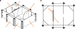
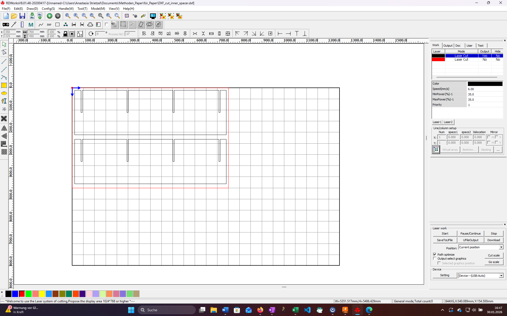
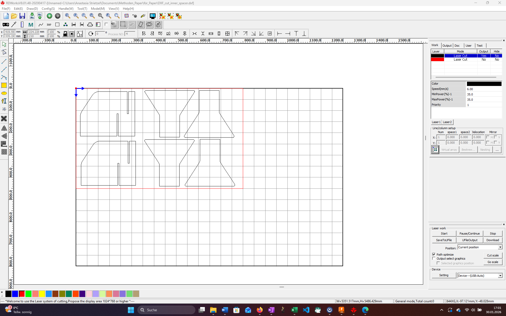
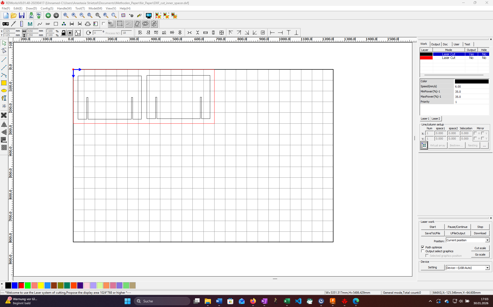
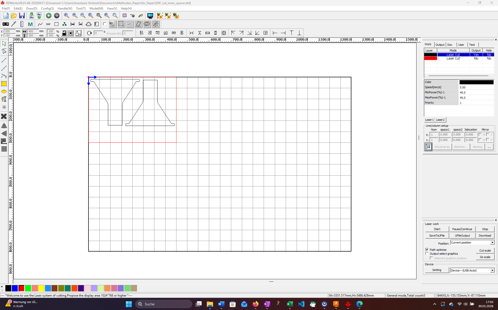

# Protocol for an open-source system to synchronize neural and behavioral data acquisition using the custom Python package XClock and a LabJack T4

The specially developed, open-source Python package XClock developed by interfaces with a LabJack T4 microcontroller and allows researchers to 

# Commercially available and custom-made parts

The following component list details the quantity, supplier, and part number of each item required to fabricate and assemble the three-chamber sociability arena.

| Quantity | Part Name | Supplier | Part Number | Unit Price | Total Price |
|---|---|---|---|---|---|
| 1 | PLEXIGLAS® Satinice sheet 700 x 450 (6 mm thickness)  | [ACRYLICS](https://acrylglas-shop.com/)  | [60940](https://acrylglas-shop.com/plexiglas-gs-satinice-wh10-dc-weiss-snow-staerke-6-mm)  | 42.21 €  | 42.21 €  |
| 2 | PLEXIGLAS® Satinice sheet 750 x 450 (6 mm thickness)  | [ACRYLICS](https://acrylglas-shop.com/)  | [60940](https://acrylglas-shop.com/plexiglas-gs-satinice-wh10-dc-weiss-snow-staerke-6-mm)  | 45.22 €  | 90.44 €  |
| 1 | PLEXIGLAS® Satinice sheet 650 x 250 (6 mm thickness)  | [ACRYLICS](https://acrylglas-shop.com/)  | [60940](https://acrylglas-shop.com/plexiglas-gs-satinice-wh10-dc-weiss-snow-staerke-6-mm) | 21.77 €   | 21.77 €   |
| 1 | PLEXIGLAS® Satinice sheet 400 x 300 (8 mm thickness) | [ACRYLICS](https://acrylglas-shop.com/) | [60950](https://acrylglas-shop.com/plexiglas-gs-satinice-wh10-dc-weiss-snow-staerke-8-mm) | 19.30 €  | 19.30€  |
| 1 | PLEXIGLAS® Clear sheet 650 x 250 (3 mm thickness)  | [ACRYLICS](https://acrylglas-shop.com/)  | [60300](https://acrylglas-shop.com/plexiglas-xt-staerke-3-mm-farblos)  | 6.44 €  | 6.44 €  |
| 8 | Aluminum profile (Nut 6) 20 x 20 x 200 mm  | [Aluprofile 24](https://aluprofile24.de/)  | [P20N6](https://aluprofile24.de/product_info.php?info=p2_strebenprofil-20x20-nut-6---zuschnitt.html)  | 0.62 €  | 4.98 €  |
| 32  | Slot nut (Nut 6, Thread M6)  | [Aluprofile 24](https://aluprofile24.de/)  | [NUSTSN6B](https://aluprofile24.de/product_info.php?info=p15_nutenstein-nut-6.html)  | 0.18 €  |  5.76 € |
| 2 (Pack of 25)  | M6 x 1.0 Stainless Steel Cap Screw, (32 screws needed for assembly) | [Thorlabs](https://www.thorlabs.com/)  | [SH6MS10](https://www.thorlabs.com/item/SH6MS10)  | 8.84 €  | 17.68 €  |
| 1 (Pack of 100)  | 1/4" Washer, M6 Compatible, Stainless Steel, (32 washers needed for assembly)  | [Thorlabs](https://www.thorlabs.com/)  | [W25S050](https://www.thorlabs.com/item/W25S050)  | 5.29 €  | 5.29 €  |

# Fabrication of the custom parts for the three-chamber sociability arena

This is a list of components that need to be fabricated (laser-cut) from the 6 mm thick PLEXIGLAS® Satinice sheets:
- long outer wall (2x)
- short outer wall (2x)
- chamber separation wall (4x)
- outer part of the door (2 per door, 4x in total)
- separation reinforcement wall (2x)

This is a list of components that need to be fabricated (laser-cut) from the 8 mm thick PLEXIGLAS® Satinice sheet:
- inner part of the door (1 per door, 2x in total)

This is a list of components that need to be fabricated (laser-cut) from the 3 mm thick PLEXIGLAS® Clear sheet:
- corner compartment walls (4x)
- corner compartment holders (8x; byproduct of the open interaction slots in the corner compartment walls)

**Figure 1.** Laser-cut parts of the three-chamber sociability arena  
(A) NE isometric view of the assembled three-chamber sociability arena, labeled to include the (1) two long outer walls, (2) two short outer walls, (3) four chamber separation walls, (4) two separation reinforcement walls, (5) four corner compartment walls, and (6) eight corner compartment holders. The second door is omitted for visual clarity.  
(B) Aerial view of the configuration shown in (A), labeled to include one door, consisting of (1a) two outer parts, and (1b) one inner part.

## Arranging of the sketches

We use an [OMTech laser cutter](https://de.omtech.com/products/100w-co2-laser-graviermaschine-cutter-mit-100x-60cm-bearbeitungsflache-autofokus-max-gr10) with an engraving area of 1000 x 600 mm. The size of the PLEXIGLAS® sheets listed above ([Commercially available and custom-made parts](#commercially-available-and-custom-made-parts)) has been calculated to fit as many components on one sheet as possible while still maintaining a minimum clearance of 1 cm from all edges and adjacent components. See the images below on how we arranged the sketches (DXF files) in RDWorks.

Both long outer walls (700 x 450 x 6 mm PLEXIGLAS® Satinice sheet):  

Both short outer walls and two of four chamber separation walls (750 x 450 x 6 mm PLEXIGLAS® Satinice sheet):  

Remaining two chamber separation walls and all four outer parts of the doors (750 x 450 x 6 mm PLEXIGLAS® Satinice sheet):  

Both separtion reinforcement walls (600 x 250 x 6 mm PLEXIGLAS® Satinice sheet):  

Both inner parts of the doors (400 x 300 x 8 mm PLEXIGLAS® Satinice sheet):

All four corner compartment walls ( x  x 3 mm PLEXIGLAS® Clear sheet); yields the needed eight corner compartment holders:

# Assembly of the three-chamber sociability arena

